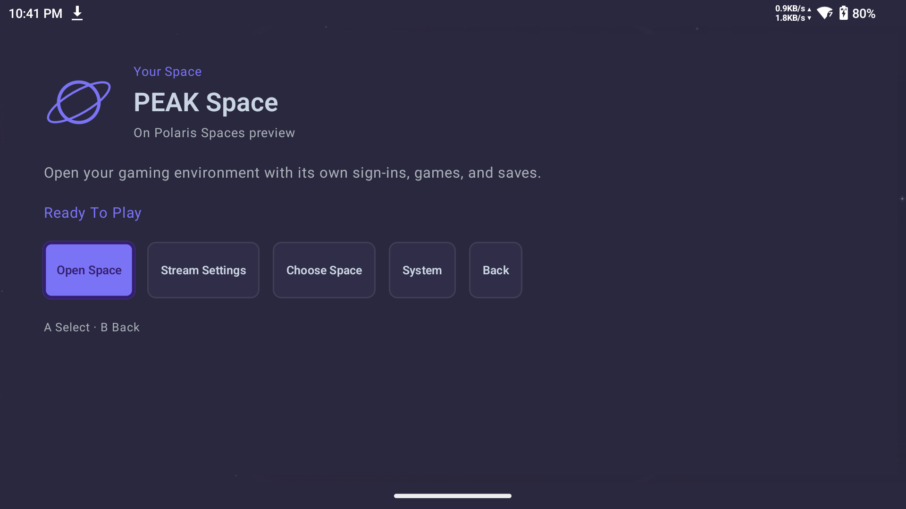
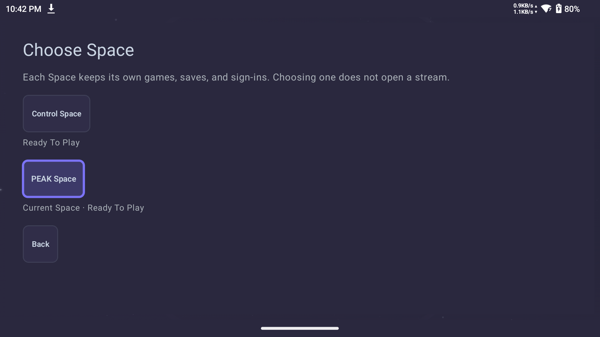
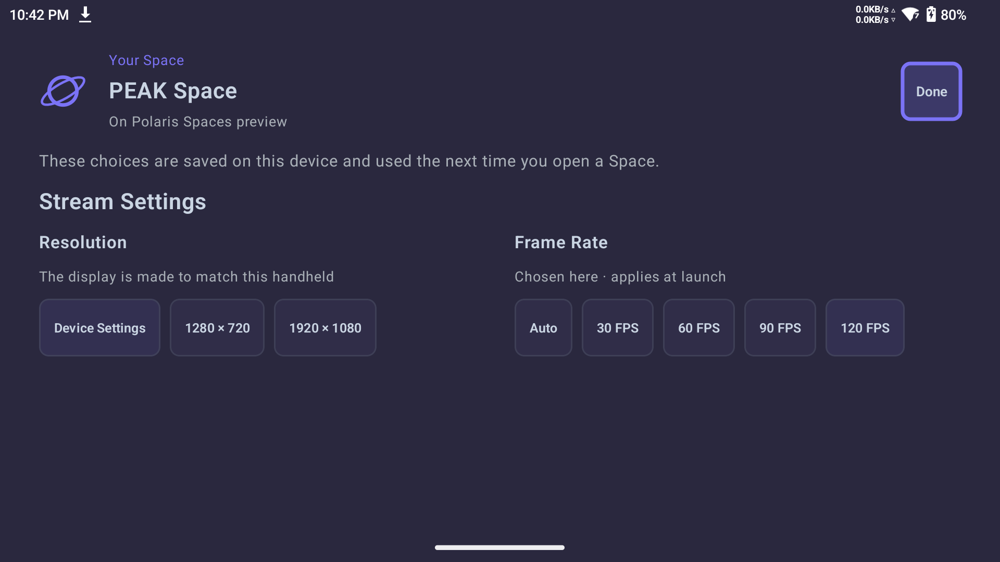

# Spaces In Nova

Spaces are optional gaming environments hosted by Polaris. Each Space keeps its
own sign-ins, installed games, and saves. Nova connects you to a Space allowed for your paired device. Streaming Presets control picture and performance settings.

This flow is part of the Spaces preview. Creating, assigning, renaming, removing,
and restoring Spaces happens in the Polaris web interface under **Spaces**.
Polaris also guides the host owner through Docker setup. Nova does not require
Docker on your Android device.

## Open Your Space

1. Pair Nova with your Polaris host if it is not already paired.
2. In Polaris, assign a Space to that device under **Spaces**, then **Default Space**.
3. Open the host in Nova. When it exposes one assigned Space, Library shows
   **Your Space**, its name, and the host name.
4. Select **Open Space**. Nova checks the host and uses your saved stream settings.
   The current Steam Space opens Steam Big Picture. Sign in there the first time.
5. Choose your game inside Steam.

The Open Space action does not require a stop at ordinary game details. A required
host check, connection error, or settings review stays visible before launching.
The host still decides whether the device is allowed to start the Space.

Nova offers **Resume Space** only when the host reports a matching session owned
by this device. A matching session owned by another device is **In Use**. An
unrelated game on the host does not become this Space's Resume action. Opening
an available Space is still subject to the host's current capacity and access.

## Choose Another Space

1. In Polaris, choose a device's **Default Space**.
2. On any additional Space card, expand **Device Access** and allow that device.
   Wait for confirmation. Changing access requires all Space streams to be stopped.
3. Open the host in Nova and select **Choose Space**. Only your permitted Spaces appear.
4. Pick a Space, then select **Open Space** when it is **Ready To Play**.

Choosing a Space does not launch it. Polaris remembers your choice for this device
across app and host restarts. Your device must finish its current stream and cleanup
before switching. Other devices can keep playing while you choose.

**In Use** means another device is using that Space. Choose another or wait for it
to become ready. Nova checks status while this screen is open and checks again
before opening. **Starting** and **Stopping** keep Open Space unavailable until the
host finishes. If status cannot be verified, check the connection and try again.
Older hosts without the chooser API retain their existing single-Space flow.

## Change Stream Settings

Select **Stream Settings** beside Open Space. The host's available choices include
**Resolution** and **Frame Rate**. These preferences are
saved on this Android device and applied on the next Space launch. Settings
currently follow the device's assigned Space; they are not separate saved presets
for each Steam account.

Select **Frame Rate**, then the desired rate when offered. Nova offers up to
**240 FPS** on supported displays; a 120 Hz handheld offers rates through
**120 FPS**. The host must also accept the requested stream. A selected rate is a
target, and does not establish sustained game rendering or actual presentation.
Check gameplay, audio and frame pacing with all intended Spaces running.

If Polaris offers a different resolution or frame rate from your explicit choice,
Nova shows the host settings and waits before opening the Space. Choose **Auto**
for **Frame Rate** and **Device Settings** for **Resolution** to follow the host,
or update the device’s display settings in Polaris and retry.

Select **Done** to return without launching. Codec, bitrate, and other device-wide
preferences remain available through **System**, then Nova's streaming settings.

Spaces currently use the host runtime's fixed codec and quality contract. Nova's
general Streaming Presets remain separate from Space selection.

## Use A Controller

The primary action receives focus when you enter. Use the D-pad to move, **A** to
select, and **B** to return. **X** opens Stream Settings from the single-Space
Library. Returning from settings restores the previous action. Touch controls
perform the same actions.

## Ordinary Streaming And Shared Hosts

Hosts serving ordinary games retain the existing Library. Nova does not add a
required Spaces tab or a setup step for ordinary streaming. With one allowed Space, Open Space stays a direct action. With several, Nova adds
**Choose Space** beside it. No extra Spaces tab is required.

Removing a Space in Polaris retains its Steam data and installed games. It removes
device access and does not reclaim disk space. Restore it and assign the device
again before returning to Nova.

## Check Sound And Stuttering

For a comparison, ask the host owner to offer 1080p at 60 FPS for your device.
In **Stream Settings**, choose **Auto** for **Frame Rate** and **Device Settings**
for **Resolution**. Begin with one Space, then check again with the other
players connected.

If audio crackles or pauses, note the time, game, Space, stream settings, and
whether the client uses Wi-Fi or Ethernet. Note whether picture or controls
paused too. Low average latency and zero reported video packet loss do not rule
out brief audio delivery pauses.

Save before reconnecting: the current runtime ends its game session when the
stream disconnects. It keeps the Space's installed games and saved data.

When possible, repeat with the same client over Ethernet or another access
point, keeping the game and stream settings unchanged. Ask the host owner to
compare with downloads, builds, and updates paused. Change one thing at a time.
The [Polaris troubleshooting steps](https://github.com/papi-ux/polaris/blob/master/docs/spaces.md#check-sound-and-stuttering)
explain what to retain for Doctor & Support. Audio reliability is still being
validated for the preview.

## Current Validation

Two configured Spaces completed a 15 minute test at 1080p and 60 FPS, with
Control Ultimate Edition on a wired Shield and PEAK on a Wi-Fi RP6. The listener
reported clean Shield audio; the RP6 continued to record audio underruns.
Reopening the RP6 Space used its retained Steam home while the Shield kept
streaming. Reopening starts a new game session after disconnect.

The [September 15 acceptance report](https://github.com/papi-ux/polaris/blob/master/docs/research/container-multiseat-acceptance-20260915.md)
records the tested builds and limits. It does not establish sustained 120 or
240 FPS gameplay, a complete first installation from published artifacts, or
reliable audio on every client.
